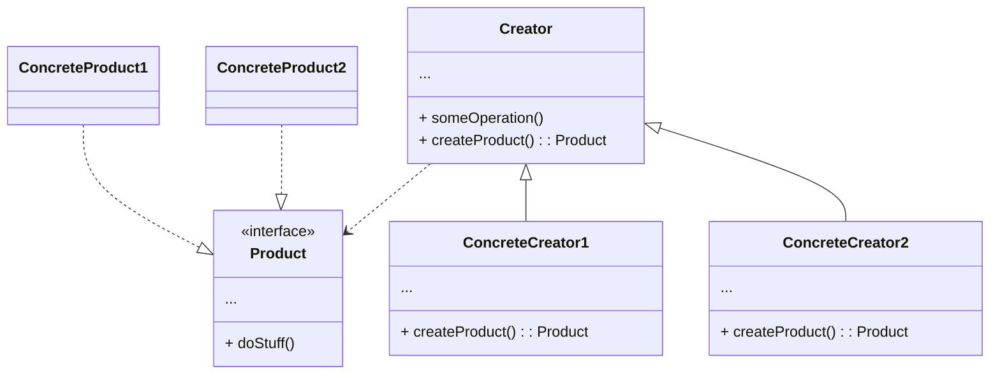

# Factory Method

**18125118 Phan Pham Thanh Tuyen**
<footer class="absolute bottom-0 right-0 p-2 text-sm">This slide is powered by <a href="https://sli.dev/">Sli<b>dev</b></a> which will give a better experience if being run on its own server</footer>

---

# Factory Method

- Is a creational design pattern
- Is also known as Virtual Constructor
- Defines an interface for creating an object
- Creates objects without exposing the creation logic to the client
- Lets subclasses responsible for creating the instance of the class

---

# Problem

- Imagine that we want to create cross-platform UI elements
- The base `Form` class uses different UI elements under various operating systems
- It requires that those elements must work the same way under arbitrary operating systems
- Let's say we define a `Button` class that has a pure virtual method called `render()`
- Its two subclasses called `WindowsButton` and `MacButton` overriding the `render()` method

---
layout: two-cols
---

# Naive Solution

```cpp{all|4-8|10-15|17-22|all}
#include <iostream>
#include <string>
using namespace std;

class Button {
public:
  virtual void render() = 0;
};

class WindowsButton : public Button {
public:
  void render() {
      cout << "WindowsButton is rendered" << endl;
  }
};

class MacButton : public Button {
public:
  void render() {
      cout << "MacButton is rendered" << endl;
  }
};
```

::right::

<div class="mt-14 ml-4">

```cpp{all|3|4-8|9-13|5,18|6|7,19|all}
int main()
{
  string OS = "WINDOWS";
  if (OS == "WINDOWS") {
    cout << "Render WindowsForm" << endl;
    Button* windowsButton = new WindowsButton();
    windowsButton->render();
  }
  else if (OS == 'MAC') {
    cout << "Render MacForm" << endl;
    Button* macButton = new MacButton();
    macButton->render();
  }

  return 0;
}

// Render WindowsForm
// WindowsButton is rendered
```

</div>

---

# Issue with Naive Solution

- The client needs to know details of each Button's subclasses
- The client ends up chaining new `else if`(s) to create new buttons for new operating systems
<uil-arrow-right /> Each time a new change is made at the library side, the client would need to make some corresponding changes at its end

---
layout: two-cols
---

# Factory Method Solution

```cpp{all|4-7|9-14|16-21|all}
#include <iostream>
using namespace std;

class Button {
public:
  virtual void render() = 0;
};

class WindowsButton : public Button {
public:
  void render() {
    cout << "WindowsButton is rendered" << endl;
  }
};

class MacButton : public Button {
public:
  void render() {
    cout << "MacButton is rendered" << endl;
  }
};
```

::right::

<div class="ml-4">

```cpp{all|1|3|4-9|5|12-17|19-24|all}
class Form {
public:
  virtual Button* factoryMethod() const = 0;
  string render() {
    Button* button = this->factoryMethod();
    button->render();
    cout << "Form is rendered" << endl;
    delete button;
  }
};

class WindowsForm : public Form {
public:
  Button* factoryMethod() {
    return new WindowsButton();
  }
};

class MacForm : public Form {
public:
  Button* factoryMethod() {
    return new MacButton();
  }
};
```

</div>

---

# Factory Method Solution

```cpp{all|1-3|6,18|7|8,19-20|10,22|11|12,23-25|all}
void ClientCode(const Form& form) {
  form.render();
}

int main() {
  cout << "Render WindowsForm";
  Form* windowsForm = new WindowsForm();
  ClientCode(*windowsForm);
  cout << endl;
  cout << "Render MacForm";
  Form* macForm = new MacForm();
  ClientCode(*macForm);
  delete windowsForm;
  delete macForm;
  return 0;
}

// Render WindowsForm
// WindowsButton is rendered
// Form is rendered

// Render WindowsForm
// WindowsButton is rendered
// Form is rendered
```

---

# Discussion

- The selection of types for object creation is totally decoupled from the client
- The Form subclasses are now responsible to decide which Button type to create
- The Client just needs to make calls to the Form's operation method without worrying about the actual implementation of the creation of objects

---

# Generic Solution

- Replace direct object construction calls with calls to a special factory method
- Override the factory method in a subclass
- Objects returned by a factory method are often referred to as products
- Subclasses may return different types of products only if these products have a common base class
- Also, the factory method in the base class should have its return type declared as this base class
- The code that uses the factory method (often called the client code) does not see a difference between the actual products returned by various subclasses

---

# Generic Class Diagram



---

# Generic Code Example <uil-java-script class="text-yellow-400" />

```ts {all|1|2|4-7|6|10|11-13|16|17-19|all}
abstract class Creator {
  public abstract factoryMethod(): Product;

  public someOperation(): string {
    const product = this.factoryMethod();
    return `Creator: The same creator's code has just worked with ${product.operation()}`;
  }
}

class ConcreteCreator1 extends Creator {
  public factoryMethod(): Product {
    return new ConcreteProduct1();
  }
}

class ConcreteCreator2 extends Creator {
  public factoryMethod(): Product {
    return new ConcreteProduct2();
  }
}
```

---

# Generic Code Example <uil-java-script class="text-yellow-400" />

```ts {all|1-3|5|6-8|11|12-14|all}
interface Product {
  operation(): string;
}

class ConcreteProduct1 implements Product {
  public operation(): string {
    return '{Result of the ConcreteProduct1}';
  }
}

class ConcreteProduct2 implements Product {
  public operation(): string {
    return '{Result of the ConcreteProduct2}';
  }
}
```

---

# Generic Code Example <uil-java-script class="text-yellow-400" />

```ts {all|8,15|9|1|2-4,16|5,17|10,18|12,19|1|2-4,20|5,21|all}
function clientCode(creator: Creator) {
  console.log(
    "Client: I'm not aware of the creator's class, but it still works."
  );
  console.log(creator.someOperation());
}

console.log('App: Launched with the ConcreteCreator1.');
clientCode(new ConcreteCreator1());
console.log('');

console.log('App: Launched with the ConcreteCreator2.');
clientCode(new ConcreteCreator2());

// App: Launched with the ConcreteCreator1.
// Client: I'm not aware of the creator's class, but it still works.
// Creator: The same creator's code has just worked with {Result of the ConcreteProduct1}

// App: Launched with the ConcreteCreator2.
// Client: I'm not aware of the creator's class, but it still works.
// Creator: The same creator's code has just worked with {Result of the ConcreteProduct2}
```

---

# When to use

- Do not know beforehand the exact types and dependencies of the objects
- Providing library or framework with a way to extend its internal components
- Saving system resources by reusing existing objects instead of rebuilding them each time

---

# Pros and Cons

<uim-check class="text-green-400" /> Avoid tight coupling between the creator and the concrete products<br /><br />
<uim-check class="text-green-400" /> Single Responsibility Principle: move the product creation code into one place in the program<br /><br />
<uim-check class="text-green-400" /> Open/Closed Principle: introduce new types of products into the program without breaking existing client<br /><br />
<br />
<uim-multiply class="text-red-400" /> The code may become more complicated since many new subclasses are introduced

---

# References

- Refactoring Guru: https://refactoring.guru/design-patterns/factory-method
